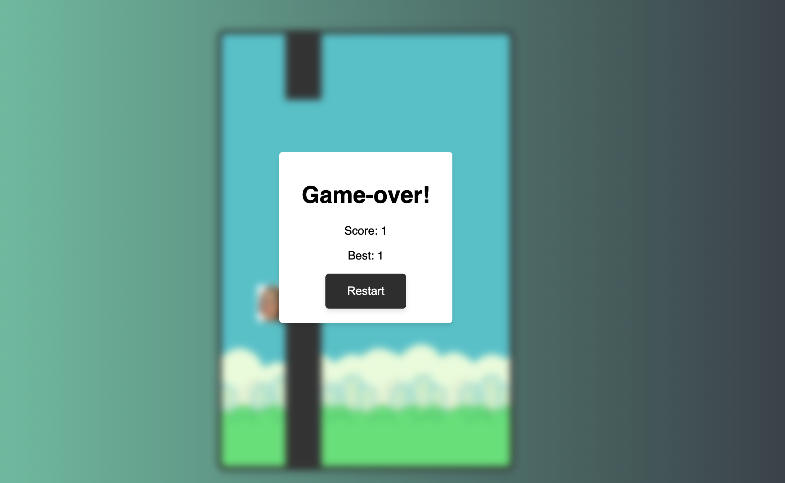

# Flappy Cass 🐦

This is a super quick project to recreate the classic Flappy Bird game using
HTML, CSS, and JavaScript. Flappy Cass features simple yet addicting gameplay
with a unique twist—our endearing little bird character, Cass!



## Table of Contents

1. [Installation](#installation)
2. [How to Play](#how-to-play)
3. [Features](#features)
4. [Technology Stack](#technology-stack)
5. [Contribution](#contribution)
6. [License](#license)

## Installation

To get started with Flappy Cass, follow these steps:

1. Clone the repository to your local machine:

```bash
git clone https://github.com/adrjmz/flappy-cass
```

2. Navigate to the project folder:

```bash
cd flappy-cass
```

3. Open the `index.html` file in your preferred web browser.

4. Enjoy the game!

## How to Play

The objective of Flappy Cass is to navigate Cass through a series of pipes
without colliding.

Controls:

- Click or press the spacebar to make Cass flap her wings and gain altitude.
- Release to let Cass descend.

Challenge yourself to achieve the highest score possible!

## Features

- Responsive design for playing on various devices.
- Classic 8-bit sound effects(COMING SOON!).
- Local high score storage.
- Colorful and intuitive user interface.

## Technology Stack

<p align="left">
  <a href="https://developer.mozilla.org/en-US/docs/Web/Guide/HTML/HTML5">
    
  </a>
  <a href="https://developer.mozilla.org/en-US/docs/Web/CSS">
    
  </a>
  <a href="https://developer.mozilla.org/en-US/docs/Web/JavaScript">
    
  </a>
</p>

## Contribution

Contributions are welcome! To contribute, follow these steps:

1. Fork the project.
2. Create a new branch for your feature or bugfix.
3. Make your changes and commit them with a descriptive message.
4. Push the changes to your fork.
5. Open a pull request to the main repository.

## License

This project is licensed under the MIT License. See [LICENSE](./LICENSE) for
more information.
